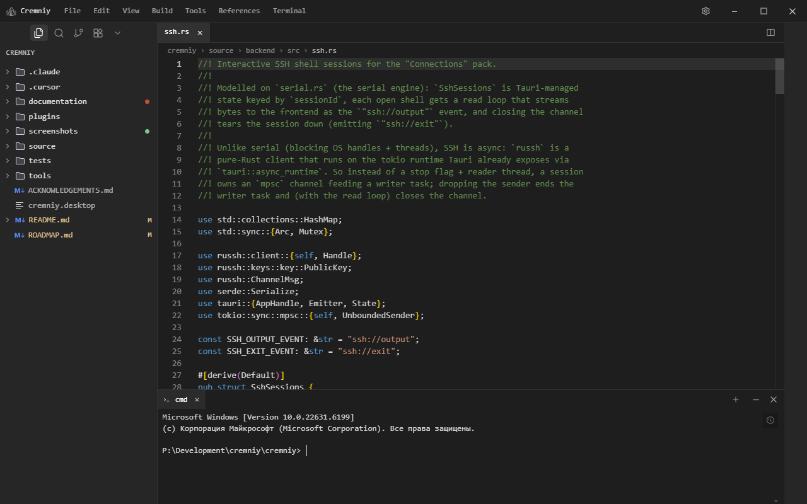
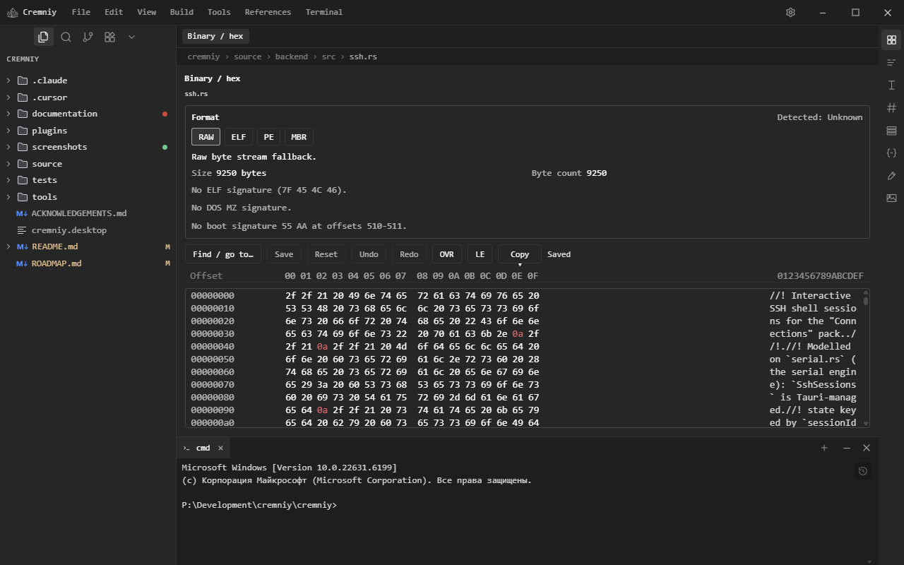
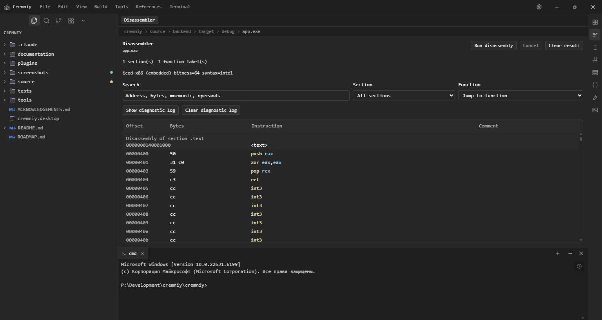
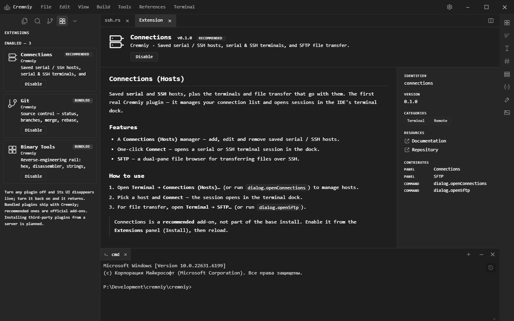

<div align="center">


<br>
<h3>Cremniy</h3>

[](LICENSE)
[](CONTRIBUTING.md)
[](https://t.me/cremniy_com)
<br>
[](https://tauri.app/)
[](https://react.dev/)

**Language / Язык:** use one section below (only one stays open in modern browsers).  
**English** — open the first block · **Русский** — откройте второй блок.

</div>

<br>

<details name="readme-lang" open>
<summary><strong>English</strong></summary>

<h6 align="center">All tools for low-level development are combined and linked in a single application — write code, edit bytes, and analyze binaries without extra windows</h6>

<br>

## Download

Pre-built installers for the latest release:

| OS | Installer | |
|----|-----------|---|
| **Windows** | `.exe` (NSIS) or `.msi` | [⬇ Latest release](https://github.com/Ramazanov-Ruslan-IT/cremniy/releases/latest) |
| **macOS** | `.dmg` | [⬇ Latest release](https://github.com/Ramazanov-Ruslan-IT/cremniy/releases/latest) |
| **Linux** | `.AppImage` or `.deb` | [⬇ Latest release](https://github.com/Ramazanov-Ruslan-IT/cremniy/releases/latest) |

Builds are currently **unsigned**, so the OS may warn on first launch:

- **Windows** — SmartScreen: *More info* → *Run anyway*.
- **macOS** — right-click the app → *Open* (or run `xattr -dr com.apple.quarantine /Applications/Cremniy.app`).
- **Linux** — `chmod +x Cremniy_*.AppImage`, then run it. The `.deb` installs with `sudo apt install ./Cremniy_*.deb`.

> If no installers are attached to the latest release yet, the first release hasn't been published — a maintainer publishes one by pushing a `vX.Y.Z` tag, which runs the [release workflow](.github/workflows/release.yml) to build all three OSes. Until then, build from source ([Development](#desktop-app-tauri--react) below).

## Desktop app (Tauri + React)

The in-repo desktop product is **Tauri 2 + React + TypeScript** under [`source/frontend/`](source/frontend/). Architecture: [BMAP](documentation/architecture/BMAP.md).

**Development:**

```bash
cd source/frontend
npm install
npm run dev
npm run tauri:dev
```

**Production build (local):**

```bash
cd source/frontend
npm run tauri:build
```

Installers and bundles are written to `source/backend/target/release/bundle/`.

The legacy **Qt/C++** IDE has been **removed** from this repository. The last revision that still contained the `src/` tree is tagged **`pre-qt-removal-2026-05-01`** (clone and `git checkout` that tag if you need the old sources for reference).

## Repository layout

| Path | Role |
|------|------|
| [`source/frontend/`](source/frontend/) | Tauri + React app (BMFP inside `source/frontend/src/`). |
| [`source/backend/`](source/backend/) | Rust Tauri crate — native shell (IPC, window, plugins). |
| [`documentation/`](documentation/) | User & contributor documentation (EN/RU); [architecture index](documentation/architecture/README.md). |
| [`plugins/`](plugins/) | First-party plugins (Connections, Git, Binary Tools). |
| [`tools/`](tools/) | Repository tooling (e.g. scripts under `tools/scripts/`). |
| [`tests/`](tests/) | Repository-level tests and orchestration (package tests stay next to each app). |
| [`.github/workflows/`](.github/workflows/) | CI and release. |

**Top-level meta-model:** [BMAP — Base Multi Application Platform](documentation/architecture/BMAP.md) (repo roots, native shell, frontend ↔ shell contract).

---

## What is Cremniy?

**Cremniy** is an integrated environment for low-level development. Instead of keeping a HEX editor in one window, a disassembler in another, and a code editor in a third — all tools are combined and linked in a single convenient application.

**Designed for:**

- 🛠 System software developers
- 🔍 Reverse engineers
- 🔐 Cybersecurity specialists
- 📡 Embedded systems developers

## Why Cremniy?

Low-level development today means using a code editor, HEX editor, disassembler, debugger, all opened **in separate windows**.

You constantly **switch** between different windows, and the tools are **not linked** together.

#### **Cremniy solves this!**
- 🔘 Everything is in one place
- 🔗 All tools are connected
- 💻 Unified workflow


## Features

### Available now

- Code editor (Monaco, syntax highlighting, search, zoom)
- Hex / binary editor (byte-level editing, undo/redo, patch export)
- Disassembler (embedded `iced-x86` engine, no external toolchain; optional `radare2`)
- Integrated terminal (persistent history, Cyrillic-layout correction)
- Reverse Calculator, Data Converter, Shellcode Generator
- **Plugins:** Connections (serial/SSH/SFTP), Source Control (Git), Binary Tools (memory map, strings, patches, symbols, functions)
- References panel (ASCII chart, keyboard scan codes)

### Coming soon

- **Debugger** — step through execution, inspect registers and memory
- **Memory visualization** — visual maps of memory layout and allocation
- **Plugin marketplace** — remote plugin loading and distribution

## Screenshots

|  |  |
|---|---|
| **One window, every tool**<br> | **Hex / binary editor**<br> |
| **Disassembler**<br> | **Everything is a plugin**<br> |

→ **[Full screenshot gallery](screenshots/README.md)** — every tool with descriptions.

## Contributing

Contributions are **welcome and encouraged**.

Whether it's a bug fix, a new feature, or an improvement to documentation — feel free to open an issue or submit a pull request.

All contributors are credited in [ACKNOWLEDGEMENTS.md](ACKNOWLEDGEMENTS.md) and mentioned in videos on the [YouTube channel](https://www.youtube.com/@igmunv).

For guidelines, see [CONTRIBUTING.md](CONTRIBUTING.md).

## License

Distributed under the terms described in [LICENSE](LICENSE).

</details>

<details name="readme-lang">
<summary><strong>Русский</strong></summary>

<h6 align="center">Все инструменты для низкоуровневой разработки объединены и связаны в одном приложении — пишите код, редактируйте байты и анализируйте бинарники без лишних окон</h6>

<br>

## Скачать

Готовые установщики последнего релиза:

| ОС | Установщик | |
|----|-----------|---|
| **Windows** | `.exe` (NSIS) или `.msi` | [⬇ Последний релиз](https://github.com/Ramazanov-Ruslan-IT/cremniy/releases/latest) |
| **macOS** | `.dmg` | [⬇ Последний релиз](https://github.com/Ramazanov-Ruslan-IT/cremniy/releases/latest) |
| **Linux** | `.AppImage` или `.deb` | [⬇ Последний релиз](https://github.com/Ramazanov-Ruslan-IT/cremniy/releases/latest) |

Сборки пока **без подписи**, поэтому ОС может предупредить при первом запуске:

- **Windows** — SmartScreen: *Подробнее* → *Выполнить в любом случае*.
- **macOS** — ПКМ по приложению → *Открыть* (или `xattr -dr com.apple.quarantine /Applications/Cremniy.app`).
- **Linux** — `chmod +x Cremniy_*.AppImage`, затем запустить. `.deb` ставится через `sudo apt install ./Cremniy_*.deb`.

> Если к последнему релизу ещё не приложены установщики — первый релиз не опубликован. Мейнтейнер публикует его пушем тега `vX.Y.Z`, который запускает [workflow релиза](.github/workflows/release.yml) и собирает все три ОС. Пока — сборка из исходников ([Разработка](#десктопное-приложение-tauri--react) ниже).

## Десктопное приложение (Tauri + React)

В репозитории официальная десктопная сборка — **Tauri 2 + React + TypeScript** в каталоге [`source/frontend/`](source/frontend/). Архитектура — [BMAP](documentation/architecture/BMAP.md).

**Разработка:**

```bash
cd source/frontend
npm install
npm run dev
npm run tauri:dev
```

**Продакшен-сборка локально:**

```bash
cd source/frontend
npm run tauri:build
```

Установщики и бандлы — в `source/backend/target/release/bundle/`.

Историческое приложение на **Qt/C++** из каталога **`src/` удалено** из этого репозитория. Последняя ревизия с деревом `src/` помечена тегом **`pre-qt-removal-2026-05-01`** (`git checkout` по тегу — если нужны исходники для справки).

## Структура репозитория

| Путь | Роль |
|------|------|
| [`source/frontend/`](source/frontend/) | Приложение Tauri + React (BMFP внутри `source/frontend/src/`). |
| [`source/backend/`](source/backend/) | Крейт Tauri на Rust — нативная оболочка (IPC, окно, плагины). |
| [`documentation/`](documentation/) | Документация (EN/RU); [индекс архитектуры](documentation/architecture/README.md). |
| [`plugins/`](plugins/) | Встроенные плагины (Connections, Git, Binary Tools). |
| [`tools/`](tools/) | Вспомогательные скрипты и утилиты репозитория (`tools/scripts/` и др.). |
| [`tests/`](tests/) | Тесты уровня репозитория; тесты пакетов — рядом с приложением. |
| [`.github/workflows/`](.github/workflows/) | CI и релиз. |

**Мета-модель репозитория:** [BMAP](documentation/architecture/BMAP.md) — корни репо, нативная оболочка, связь фронта и оболочки.

---

## Что такое Cremniy?

**Cremniy** — интегрированная среда для низкоуровневой разработки. Вместо того чтобы держать HEX-редактор в одном окне, дизассемблер в другом, а редактор кода в третьем — всё это объединено и связано в одном удобном приложении.

**Ориентирован на:**

- 🛠 Разработчиков системного ПО
- 🔍 Reverse-инженеров
- 🔐 Специалистов по информационной безопасности
- 📡 Разработчиков embedded-систем

## Почему Cremniy?

Низкоуровневая разработка сегодня — это редактор кода, HEX-редактор, дизассемблер, отладчик, открытые **в разных окнах**.

Вы постоянно **переключаетесь** между разными окнами, и при этом инструменты **не связаны** между собой.

#### **Cremniy решает это!**
- 🔘 Всё находится в одном месте
- 🔗 Всё связано между собой
- 💻 Единый workflow


## Возможности

### Доступно сейчас

- Редактор кода (Monaco, подсветка синтаксиса, поиск, масштаб)
- HEX/бинарный редактор (правка байтов, undo/redo, экспорт патчей)
- Дизассемблер (встроенный движок `iced-x86`, без внешнего тулчейна; опционально `radare2`)
- Встроенный терминал (история команд, коррекция кириллической раскладки)
- Обратный калькулятор, конвертер данных, генератор шелл-кода
- **Плагины:** Connections (serial/SSH/SFTP), Source Control (Git), Binary Tools (карта памяти, строки, патчи, символы, функции)
- Панель References (таблица ASCII, скан-коды клавиш)

### В планах

- **Отладчик** — пошаговое выполнение, просмотр регистров и памяти
- **Визуализация памяти** — наглядные карты расположения и выделения памяти
- **Маркетплейс плагинов** — удалённая загрузка и распространение плагинов

## Скриншоты

|  |  |
|---|---|
| **Все инструменты в одном окне**<br> | **HEX / бинарный редактор**<br> |
| **Дизассемблер**<br> | **Всё — плагин**<br> |

→ **[Полная галерея скриншотов](screenshots/README.md)** — все инструменты с описанием.

## Участие в разработке

Вклад в проект **приветствуется**.

Будь то исправление ошибок, новая функциональность или улучшение документации — открывайте issue или отправляйте pull request.

Все участники указываются в [ACKNOWLEDGEMENTS.md](ACKNOWLEDGEMENTS.md) и упоминаются в видео на [YouTube-канале](https://www.youtube.com/@igmunv).

Подробнее — в [CONTRIBUTING.md](CONTRIBUTING.md).

## Лицензия

Распространяется на условиях, описанных в [LICENSE](LICENSE).

</details>
