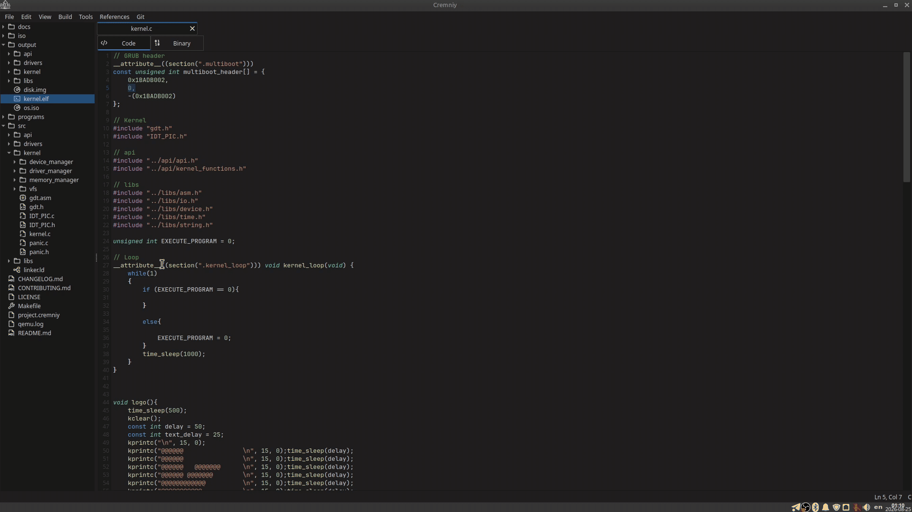

<div align="center">


<br>
<h3>Cremniy</h3>
<h6>Все инструменты для низкоуровневой разработки объединены и связаны в одном приложении — пишите код, редактируйте байты и анализируйте бинарники без лишних окон</h6>

[](LICENSE)
[](CONTRIBUTING.md)
[](https://t.me/cremniy_com)
<br>
[](https://en.cppreference.com/w/cpp/17)
[](https://www.qt.io/)

[English](README.md) • Русский

</div>

<br>

## Что такое Cremniy?

**Cremniy** — интегрированная среда для низкоуровневой разработки. Вместо того чтобы держать HEX-редактор в одном окне, дизассемблер в другом, а редактор кода в третьем — всё это объединено и связано в одном удобном приложении.

**Ориентирован на:**

- 🛠 Разработчиков системного ПО
- 🔍 Reverse-инженеров
- 🔐 Специалистов по информационной безопасности
- 📡 Разработчиков embedded-систем

## Почему Cremniy?

Низкоуровневая разработка сегодня — это редактор кода, HEX-редактор, дизассемблер, отладчик, открытые **в разных окнах**.

Вы постоянно **переключаетесь** между разными окнами, и при этом инструменты **не связаны** между собой.

#### **Cremniy решает это!**
- 🔘 Всё находится в одном месте
- 🔗 Всё связано между собой
- 💻 Единый workflow



## Возможности ✨

### Доступно сейчас

| Функция | Описание |
|---|---|
| 📝 Редактор кода | Написание и редактирование низкоуровневого кода с поддержкой синтаксиса |
| 🔢 HEX-редактор | Просмотр и изменение бинарных данных на уровне байт (патчинг) |
| 🔧 Дизассемблер | Декодирование машинных инструкций в читаемый ассемблер |

### В планах

- 🐛 **Отладчик** — пошаговое выполнение, просмотр регистров и памяти
- 🧠 **Визуализация памяти** — наглядные карты расположения и выделения памяти

## Участие в разработке 👋

Вклад в проект **приветствуется**.

Будь то исправление ошибок, новая функциональность или улучшение документации — открывайте issue или отправляйте pull request.

Все задачи находятся в [**GitHub Projects**](https://github.com/orgs/munirov/projects/2/views/1).

Все участники указываются в [ACKNOWLEDGEMENTS.md](ACKNOWLEDGEMENTS.md) и упоминаются в видео на [YouTube-канале](https://www.youtube.com/@igmunv).

Подробнее — в [CONTRIBUTING.md](CONTRIBUTING_ru.md).

> [!WARNING]
> Если вы хотите взять задачу в работу, пожалуйста, оставьте комментарий в соответствующем [Issue](https://github.com/munirov/cremniy/issues). Это необходимо, чтобы избежать дублирования работы.
>
> Также после отправки Pull Request'а, укажите соответствующий [Issue](https://github.com/munirov/cremniy/issues) в описании к Pull Request'у с помощью строки `Closes #НОМЕР_ISSUE`

## Сборка 🛠️

### Зависимости

| Зависимость | Мин. версия |
|---|---|
| **[CMake](https://cmake.org/download/)** | 3.16 |
| **[Qt](https://www.qt.io/development/download-qt-installer-oss)** | 6.8.2 |
| **[libgit2](https://libgit2.org/)** | 1.x |
| **Компилятор C++** | Поддержка C++17 |

<details>
<summary><b>🪟 Windows</b></summary>

1. Установить [MSYS2](https://www.msys2.org/)
2. Установить MinGW, CMake, Qt6-base и libgit2 через **терминал MSYS2**:
```base
pacman -S --needed base-devel mingw-w64-ucrt-x86_64-toolchain mingw-w64-ucrt-x86_64-cmake mingw-w64-ucrt-x86_64-qt6-base mingw-w64-ucrt-x86_64-libgit2
```
3. Добавить папку с пакетами MSYS2 в PATH  
   По умолчанию MSYS2 пакеты находятся в `C:\msys64\ucrt64\bin`

</details>

<details>
<summary><b>🐧 Linux (Debian-based / Fedora)</b></summary>

Для дистрибутивов, основанных на Debian:
```bash
sudo apt update
sudo apt install cmake g++ qt6-base-dev qt6-svg-dev qt6-tools-dev-tools libgit2-dev zlib1g-dev libssl-dev libpcre2-dev libhttp-parser-dev
```
Для Fedora:
```bash
sudo dnf update --refresh
sudo dnf install cmake gcc-c++ qt6-qtbase-devel qt6-qtsvg-devel qt6-qttools-devel libgit2-devel zlib-devel openssl-devel pcre2-devel http-parser-devel
```

> ℹ️ **NOTE:** 
> Если пакет `qt6-base-dev` недоступен в вашем дистрибутиве, используйте [официальный установщик Qt](https://www.qt.io/download-qt-installer-oss).

</details>

<details>
<summary><b>🍎 macOS</b></summary>

С помощью [Homebrew](https://brew.sh/):

```bash
brew install cmake qt@6 libgit2
```

</details>

### Linux cборка

```bash
git clone https://github.com/igmunv/cremniy.git
cd cremniy

mkdir build && cd build
cmake ../src
cmake --build .
```

#### Сборка в режиме Release

```bash
cmake ../src -DCMAKE_BUILD_TYPE=Release
cmake --build . --config Release
```

### Windows сборка

```bash
git clone https://github.com/igmunv/cremniy.git
cd cremniy

mkdir build && cd build
cmake -G "MinGW Makefiles" ..\src
cmake --build .

```

#### Сборка в режиме Release

```bash
cmake ..\src -DCMAKE_BUILD_TYPE=Release
cmake --build . --config Release
```

## Лицензия 📖

Распространяется на условиях, описанных в [LICENSE](LICENSE).
