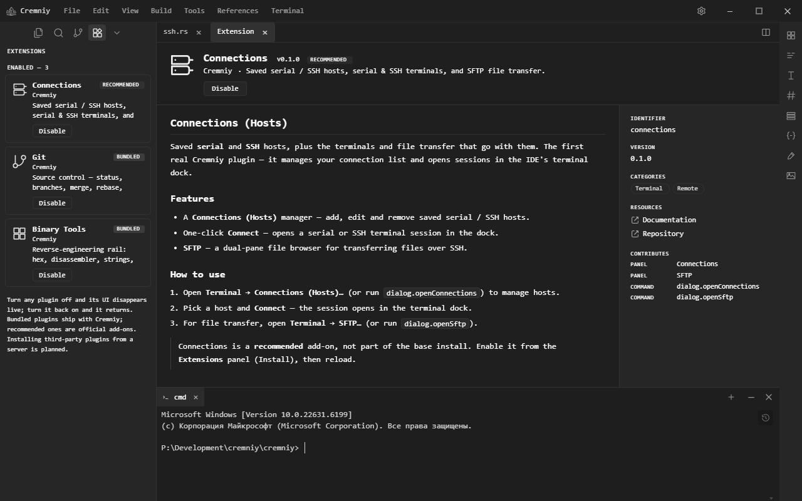
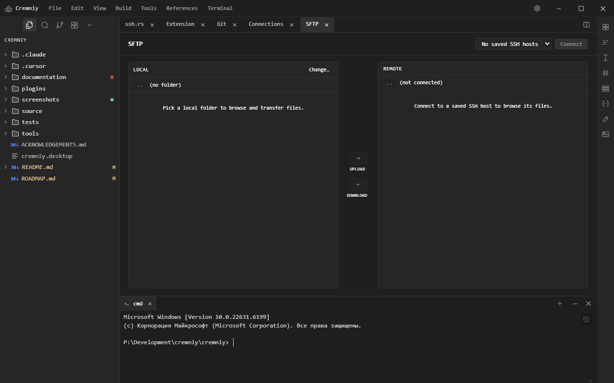

# Screenshots

A visual tour of Cremniy — an integrated environment for low-level and
reverse-engineering work. Every tool lives in one window and the feature set is
built from plugins. · Визуальный тур по Cremniy.

---

### 1. One window, every tool · Все инструменты в одном окне

Code editor, file tree, editor tabs and an integrated terminal in a single
window — the whole low-level workflow without switching between separate apps.

> Редактор кода, дерево файлов, вкладки и встроенный терминал в одном окне —
> весь низкоуровневый процесс без переключения между приложениями.

---

### 2. Hex / binary editor · HEX / бинарный редактор

Byte-level editing with side-by-side hex and ASCII panes, undo/redo and patch
export. Recognises common container formats (ELF, PE, MBR and friends).

> Правка на уровне байтов: hex- и ASCII-панели рядом, undo/redo и экспорт
> патчей. Распознаёт распространённые форматы (ELF, PE, MBR и другие).

---

### 3. Source control, built in · Встроенный контроль версий

The Git plugin opens as a center tab — local and remote branches, stash,
history and merge/rebase, working against a real repository.

> Плагин Git открывается центральной вкладкой — локальные и удалённые ветки,
> stash, история, merge/rebase на настоящем репозитории.

---

### 4. Everything is a plugin · Всё — плагин

Connections, Source Control and Binary Tools are plugins. Enable or disable any
of them from the Extensions panel — the UI appears or disappears live, with no
reload.

> Connections, Source Control и Binary Tools — это плагины. Включайте или
> выключайте любой из панели Extensions — интерфейс появляется и исчезает сразу,
> без перезапуска.

---

### 5. A page for every plugin · Страница у каждого плагина

Each plugin has its own details tab — description, the panels and commands it
contributes, version, author and links — rendered from the plugin's manifest.

> У каждого плагина своя вкладка с описанием — какие панели и команды он
> добавляет, версия, автор и ссылки — из манифеста самого плагина.

---

### 6. Connections · Подключения

Save serial, SSH and SFTP hosts and open them as terminal tabs — part of the
Connections plugin.

> Сохраняйте serial-, SSH- и SFTP-хосты и открывайте их вкладками терминала —
> плагин Connections.

---

### 7. SFTP file transfer · Передача файлов по SFTP

A dual-pane local ↔ remote file browser over SSH — upload and download without
leaving the IDE.

> Двухпанельный обзор «локально ↔ удалённо» поверх SSH — загрузка и скачивание
> не выходя из IDE.
